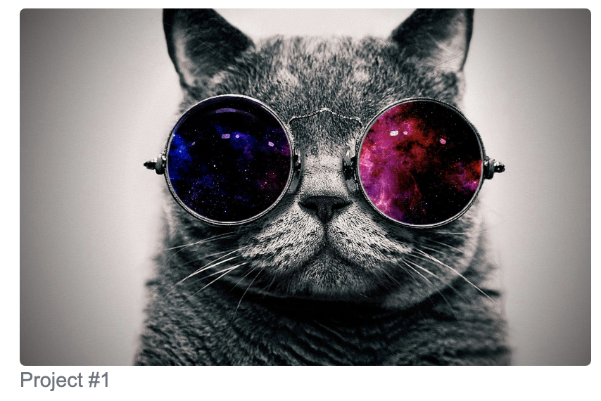
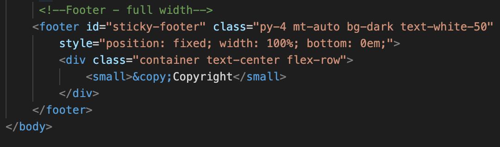
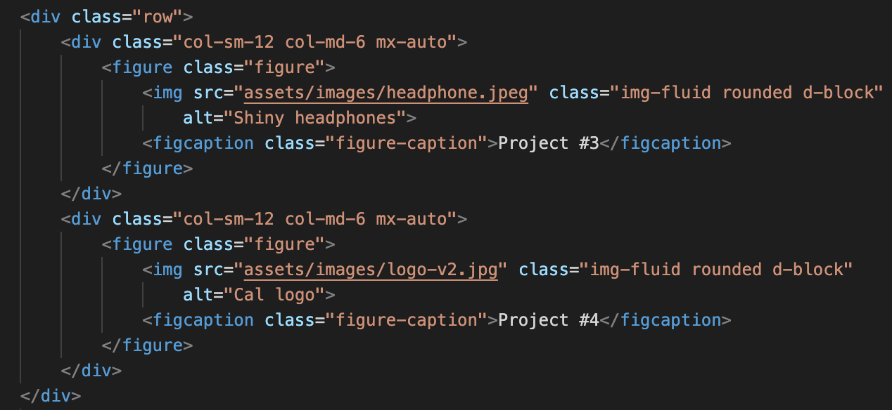

# Colin Whitcomb 

## Deployed Site
1) https://colin-whitcomb.github.io/responsive-portfolio-/
___
## Summary & Process

In this assignment our objective was to create a responsive portfolio webpage utilizing Bootstrap's grid system. 

I began by conceptualizing the framework of working elements through an extensive pseduocode process; however, some of these plans transformed. My initial coding created the base elements that would be shared across multiple pages (i.e. Navbar, Footer, background etc...) on the contact page - moving to the home page and portfolio afterwards. 

Although I made sure that my pages and images were responsive, I also took the time to add a sticky footer, utilized nested rows in the portfolio page, added some shadow elements, and rounded all image corners (see below). Additionally, I linked the name button to my LinkedIn account and added the subtext accordingly. 
___
## Screenshots 

1. **Rounded Image Corners**

___
2. **Sticky Footer** 

3. **Nested Rows** 

___
## Technologies / Resources
- Visual Studio Code
- Git / GitHub / GitPages
- Bootstrap / HTML 

- For this exercise I relied heavily on the getbootstrap.com documentation.
--- 
## Author

* **Colin Whitcomb** [LinkedIn](https://ww.linkedin.com/in/colin-whitcomb-b808301a6/)

___
